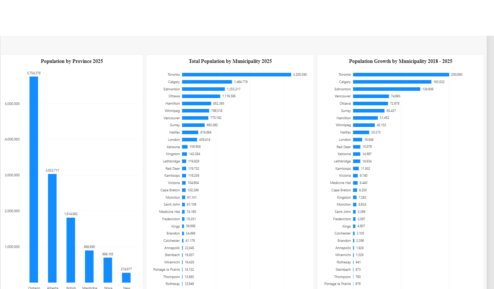
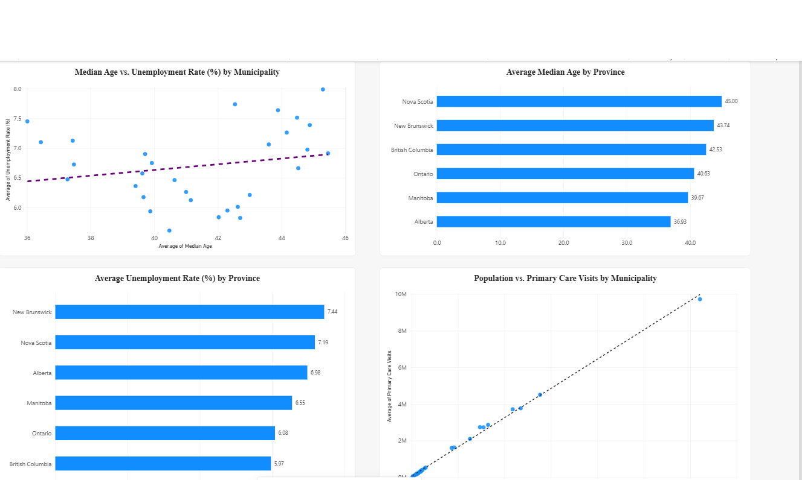

# Population & Community Demographics Analysis

## Project Overview

This project uses Power BI to analyze population growth, demographics, unemployment, housing activity, and community indicators across Canadian municipalities from 2018–2025.

The project was designed to simulate a real-world analysis that could support municipal or regional planning. The focus was not only on creating visualizations, but on following a complete data analytics workflow:

**Define the questions → Prepare and validate the data → Analyze the data → Build visualizations → Identify insights → Create an executive dashboard.**

---

## Dataset

The dataset contains **240 records** covering:

- 6 Canadian provinces
- 30 municipalities
- 8 years (2018–2025)

It includes population, median age, unemployment, household income, birth and death rates, migration, households, housing starts, primary care visits, and school enrolment.

### How the Data Was Created

I prompted an AI tool to generate a **synthetic dataset** specifically for this portfolio project. The purpose was to create a realistic dataset that would allow me to practice a complete data analytics workflow.

**NOTE**: The dataset is **NOT an official Canadian government data** and the values should not be interpreted as real-world statistics.

---

## Business Questions

Before beginning the analysis, I defined the questions I wanted the data to answer:

### Population
- What was the total population in 2025?
- Which province and municipality had the largest population?
- How did total population change from 2018–2025?
- Which province and municipality experienced the greatest population growth?
- Were there municipalities with declining or relatively stable populations?

### Demographics & Employment
- Which provinces had the highest and lowest average median age?
- Which provinces had the highest and lowest unemployment rates?
- Was there an observable relationship between median age and unemployment?

### Housing & Community Services
- Which municipalities had the highest housing activity?
- How did population size compare with primary care visits?

The broader planning question was:

 **What observations from the data should a municipal or regional planning team investigate further?**

---

## Tools & Their Roles

**Microsoft Excel**: Used to store and organize the raw dataset before analysis.

**Power Query**: Used within Power BI to inspect and prepare the data, including reviewing data types, missing values, data quality, and duplicate municipality-year combinations.

**DAX**: Used to create analytical measures such as Total Population, Population Increase, Population Growth %, Province Population Growth, and Municipality Population Growth.

**Power BI**: Used for data analysis, visualization, dashboard development, and communicating the final findings.

---

## Data Preparation

Before building the report, I performed several data-quality checks, including:

- Reviewing column names and data types
- Investigating missing values
- Checking for duplicate municipality-year combinations
- Confirming the dataset grain
- Validating numerical fields
- Preserving missing values rather than incorrectly treating them as zero

This ensured the data was appropriately prepared before analysis.

---

# Executive Dashboard

The **Population & Community Planning Dashboard** was designed as a concise management-level overview rather than a collection of every visual created during the analysis.

It focuses on four key areas:

### Population Size
**Total Population 2025 — 12,473,849**

Provides the overall population represented in the latest year.

### Population Change
**Population Increase (2018 – 2025) — 990,710**

**Population Growth — 8.6%**

Shows both the absolute and percentage change over the analysis period.

### Geographic Growth
**Population Growth by Province — (2018 – 2025)**

Shows where population growth was concentrated geographically.

### Housing Activity
**Housing Starts by Municipality — (2018 – 2025)**

Provides a housing-development perspective alongside population growth.

These metrics were selected to give a planning team a quick answer to:

**How large is the population? → How is it changing? → Where is growth occurring? → How does housing activity compare?**

The detailed report pages then allow users to investigate population, demographic, employment, and community-service patterns in greater depth.

---

## Dashboard Pages

### Page 1 — Executive Dashboard

High-level overview of population size, population growth, provincial growth, population trends, and housing activity.

### Page 2 — Population Analysis

Provides more detailed comparisons of population by province and municipality, as well as municipal population growth from 2018–2025.

### Page 3 — Demographics & Community Analysis

Examines median age, unemployment, the relationship between age and unemployment, and population compared with primary care visits.

---

## Key Findings

- Total population reached **12,473,849 in 2025**.
- Population increased by **990,710 (8.6%)** between 2018 and 2025.
- **Ontario** had the largest population in 2025 and the largest absolute population growth.
- **Toronto** had the largest municipal population in 2025.
- **Ottawa** experienced the largest municipal population growth.
- Median age and unemployment showed a slight positive visual relationship, although the observations were scattered and do not establish causation.
- Population and primary care visits showed a strong positive visual relationship, which should not be interpreted as a measure of healthcare access or quality.

Because the dataset is synthetic, these findings demonstrate the analytical process rather than representing actual Canadian demographic conditions.

---

## Potential Planning Applications

With real-world data, this type of analysis could help support further investigation into:

- Housing demand and development
- Infrastructure requirements
- Healthcare service demand
- Education and school capacity
- Workforce and employment conditions
- Population aging
- Migration patterns
- Municipal resource planning

The dashboard is intended as a **starting point for investigation and decision support**, rather than a standalone decision-making tool.

---

## Skills Demonstrated

- Data cleaning and validation
- Power Query
- DAX calculations
- Exploratory data analysis
- Trend and growth analysis
- Geographic comparisons
- Relationship analysis
- Data visualization
- Dashboard design
- Data storytelling
- Business-question-driven analysis

---

## Project Files

- **`.pbix`** — Power BI report
- **`.xlsx`** — Dataset and data dictionary
- **`.png`** — Dashboard screenshots

---

## Project Objective

This project demonstrates my ability to take a dataset from **raw data through preparation, analysis, visualization, and executive reporting**.

The goal was to demonstrate not just how to build a Power BI dashboard, but how to approach a data problem from a **business-question and decision-support perspective**.
